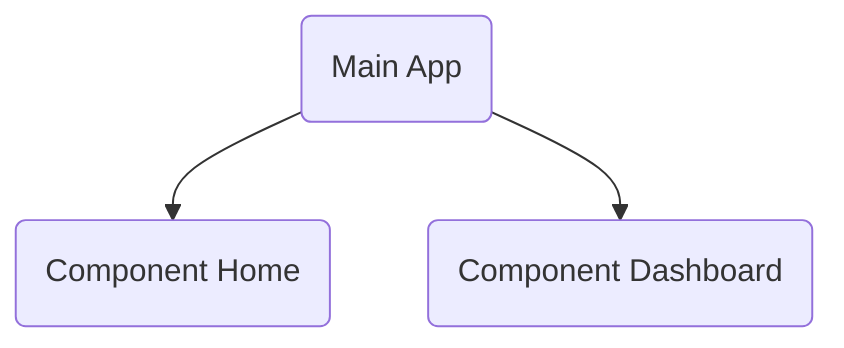

[](https://jitpack.io/#ssseasonnn/Butterfly)

# Butterfly

*Read this in other languages: [中文](README.zh.md), [English](README.md), [Change Log](CHANGELOG.md)*

Butterfly is a versatile component-based navigation framework based on `Coroutine + Annotation + Ksp`.
Not only does it support navigation for Activity, Fragment, and DialogFragment, but it also supports navigation for Compose pages.

Butterfly supports configuring startup modes for Fragment and Composite navigation, including Standard mode navigation
ClearTop clears stack top mode navigation and SingleTop reuse mode navigation.

Butterfly provides a unified fallback stack for managing all types of page navigation, using standard fallback APIs to reduce developer workload.

Butterfly also provides a powerful framework for inter component communication, allowing for true component decoupling without any dependencies between components.


## Feature List

The butterfly provides these features：

✅ Support navigation to Activity <br>
✅ Support navigation to Fragment <br>
✅ Support navigation to DialogFragment <br>
✅ Support navigation to Compose <br>
✅ Support navigation to Action <br>
✅ Support parameter transfer and parse <br>
✅ Support interceptor <br>
✅ Support backstack <br>
✅ Support group manage <br>
✅ Support launch mode，such as SingleTop、ClearTop <br>
✅ Support component communicate <br>

## Installation

```kotlin
// Add jitpack repository
repositories {
  maven { url("https://jitpack.io") }
}
```

```kotlin
// First, declare the KSP plugin in your top level build.gradle.kts file.
plugins {
    id("com.google.devtools.ksp") version "1.8.10-1.0.9" apply false
}

// Then, enable KSP in your module-level build.gradle.kts file:
plugins {
    id("com.google.devtools.ksp")
}


// Then, add Butterfly dependencies.
dependencies {
  implementation("com.github.ssseasonnn.Butterfly:butterfly:1.3.0")
  ksp("com.github.ssseasonnn.Butterfly:compiler:1.3.0")

  //for compose
  implementation("com.github.ssseasonnn.Butterfly:butterfly-compose:1.3.0")
}
```

## Basic Usage

### Navigation

Butterfly support navigation for Activity、Fragment and DialogFragment and Compose component.

```kotlin
@Destination("test/activity")
class TestActivity : AppCompatActivity()

@Destination("test/fragment")
class TestFragment : Fragment()

@Destination("test/dialog")
class TestDialogFragment : DialogFragment()

@Destination("test/compose")
@Composable
fun HomeScreen() {}

//Navigation
Butterfly.of(context).navigate("test/xxx")

//Navigation and get result
Butterfly.of(context).navigate("test/xxx") {
    val result = it.getStringExtra("result")
    binding.tvResult.text = result
}
```

### Communication

Butterfly implements component-based communication through `Evade` and `EvadeImpl` 
annotations. And the communication between components without any dependence 
is supported by dynamic agent technology.

For example, two components, `Home` and `Dashboard`, component `Dashboard` need to call the method in the component `Home`:



```kotlin
//Define the Api that needs to access the Home in the component Dashboard and add the @ Evade annotation
@Evade
interface DashboardCallHomeApi {
    fun showHome(fragmentManager: FragmentManager, container: Int)
}


//Implement the corresponding Api in the component Home and add the @ EvadeImpl annotation
@EvadeImpl
class DashboardCallHomeApiImpl {  //The implementation class name must end with Impl
    val TAG = "home_tag"

    //For the implementation of HomeApi, the method name and parameters must be the same
    fun showHome(fragmentManager: FragmentManager, container: Int) {
        val homeFragment = HomeFragment()
        fragmentManager.beginTransaction()
            .replace(container, homeFragment, TAG)
            .commit()
    }
}

//You can then invoke the interface in the component Home in the component Dashboard:
val dashboardCallHomeApi = Butterfly.evade<DashboardCallHomeApi>()
dashboardCallHomeApi.showHome(supportFragmentManager, R.id.container)
```

## Documentation

See examples and browse complete documentation at the Butterfly Wiki: [wiki](https://github.com/ssseasonnn/Butterfly/wiki)

If you still have questions, feel free to create a new issue.


## License

> ```
> Copyright 2022 Season.Zlc
>
> Licensed under the Apache License, Version 2.0 (the "License");
> you may not use this file except in compliance with the License.
> You may obtain a copy of the License at
>
>    http://www.apache.org/licenses/LICENSE-2.0
>
> Unless required by applicable law or agreed to in writing, software
> distributed under the License is distributed on an "AS IS" BASIS,
> WITHOUT WARRANTIES OR CONDITIONS OF ANY KIND, either express or implied.
> See the License for the specific language governing permissions and
> limitations under the License.
> ```
