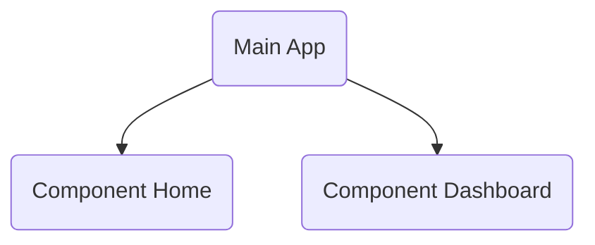

[](https://jitpack.io/#ssseasonnn/Butterfly)

# Butterfly

*Read this in other languages: [中文](README.zh.md), [English](README.md), [Change Log](CHANGELOG.md)*

Butterfly是一个基于`Coroutine + Annotation注解 + Ksp注解处理器`打造的全能的组件化路由框架。
不仅支持Activity、Fragment、DialogFragment的导航，还支持Compose页面的导航。

Butterfly支持为Fragment和Compose的导航配置启动模式， 包括Standard标准模式导航、
ClearTop清除栈顶模式导航以及SingleTop栈顶复用模式导航。

Butterfly提供统一的回退栈对所有类型的页面导航进行管理，使用标准的回退Api，减轻开发者工作负担。

Butterfly还提供强大的组件间通信框架，可在组件间没有任何依赖情况下通信，实现真正的组件解耦。


## 功能列表

Butterfly提供以下功能：

✅ 支持导航Activity <br>
✅ 支持导航Fragment <br>
✅ 支持导航DialogFragment <br>
✅ 支持导航Compose <br>
✅ 支持导航Action <br>
✅ 支持导航参数传递和解析 <br>
✅ 支持拦截器 <br>
✅ 支持回退栈 <br>
✅ 支持组管理 <br>
✅ 支持启动模式，如SingleTop、ClearTop <br>
✅ 支持组件化通信 <br>

## 安装

```gradle
repositories {
  maven { url 'https://jitpack.io' }
}
```

```gradle
apply plugin: 'kotlin-kapt'

dependencies {
  implementation 'com.github.ssseasonnn.Butterfly:butterfly:1.3.0'
  kapt 'com.github.ssseasonnn.Butterfly:compiler:1.3.0'

  //for compose
  implementation 'com.github.ssseasonnn.Butterfly:butterfly-compose:1.3.0'
}
```

## 基本用法

### 导航

Butterfly支持Activity、Fragment、DialogFragment和Compose组件的导航。

```kotlin
@Destination("test/activity")
class TestActivity : AppCompatActivity()

@Destination("test/fragment")
class TestFragment : Fragment()

@Destination("test/dialog")
class TestDialogFragment : DialogFragment()

@Destination("test/compose")
@Composable
fun HomeScreen() {}

//导航
Butterfly.of(context).navigate("test/xxx")

//导航并获取结果
Butterfly.of(context).navigate("test/xxx") {
    val result = it.getStringExtra("result")
    binding.tvResult.text = result
}
```

### 组件间通信

Butterfly通过`Evade`和`EvadeImpl`注解实现组件化通信。并且通过动态代理技术支持组件间在无任何依赖的情况下的通信。

### 1. 在没有依赖的组件之间通信

例如两个组件`Home`和组件`Dashboard`，组件`Dashboard`需要调用组件`Home`中的方法:



```kotlin
//在组件Dashboard中定义需要访问Home对应的Api，并添加@Evade注解
@Evade
interface DashboardCallHomeApi {
    fun showHome(fragmentManager: FragmentManager, container: Int)
}


//在组件Home中实现对应的Api，并添加@EvadeImpl注解
@EvadeImpl
class DashboardCallHomeApiImpl {  //实现类名必须以Impl结尾
    val TAG = "home_tag"

    //HomeApi的实现，方法名和方法参数必须相同
    fun showHome(fragmentManager: FragmentManager, container: Int) {
        val homeFragment = HomeFragment()
        fragmentManager.beginTransaction()
            .replace(container, homeFragment, TAG)
            .commit()
    }
}

//然后就可以在组件Dashboard中调用组件Home中的接口：
val dashboardCallHomeApi = Butterfly.evade<DashboardCallHomeApi>()
dashboardCallHomeApi.showHome(supportFragmentManager, R.id.container)
```

## 详细文档

查看示例并浏览完整的文档，请访问Butterfly Wiki：[wiki](https://github.com/ssseasonnn/Butterfly/wiki)

如果您仍有疑问，请随意创建新的issue。


## License

> ```
> Copyright 2022 Season.Zlc
>
> Licensed under the Apache License, Version 2.0 (the "License");
> you may not use this file except in compliance with the License.
> You may obtain a copy of the License at
>
>    http://www.apache.org/licenses/LICENSE-2.0
>
> Unless required by applicable law or agreed to in writing, software
> distributed under the License is distributed on an "AS IS" BASIS,
> WITHOUT WARRANTIES OR CONDITIONS OF ANY KIND, either express or implied.
> See the License for the specific language governing permissions and
> limitations under the License.
> ```
